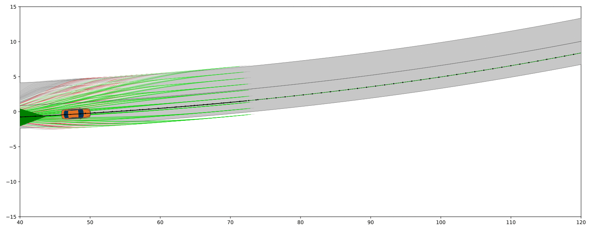

[](https://zenodo.org/records/10078062)

[](https://www.linux.org/)
[](https://www.python.org/downloads/release/python-3110/)[](https://www.python.org/downloads/release/python-3100/) [](https://www.python.org/downloads/release/python-390/)


# FFRENETIX Motion Planner & Multi-agent Scenario Handler

Welcome to the TUM FRENETIX Motion Planner. Here you find the modules, the code and the information to run our high performance motion planning algorithm for autonomous driving tasks.




<details>
<summary> <h2> 📖 Overview Modules </h2> </summary>

This repository includes a Frenet trajectory planning algorithm and a Multi-agent Simulation Framework in the [CommonRoad](https://commonroad.in.tum.de/) scenario format.
The trajectories are generated according to the sampling-based approach in [1-5] including two different implementations.
The Repo provides a python-based and a C++-accelerated Motion Planner [Frenetix](https://github.com/TUM-AVS/Frenetix/) implementation.
The multi-agent simulation can be used to integrate and test different planning algorithms. FRENETIX is an modular and adaptive motion planning environment that allows researchers to add and exchange the following modules:


Detailed documentation of the functionality behind the single modules can be found below.

1. [General Motion Planning Algorithm](README.md)

2. [Frenetix C++ Trajectory Handler](https://github.com/TUM-AVS/Frenetix)

3. [Commonroad Scenario Handler](cr_scenario_handler/README.md)

4. [Module M2: Behavior Planner](behavior_planner/README.md)

5. [Module M3: Occlusion-aware Module](https://github.com/TUM-AVS/Frenetix-Occlusion)

6. [Module M4: Trajectory Prediction: Wale-Net](https://github.com/TUMFTM/Wale-Net)

7. [Module M5: Risk-Assessment](https://github.com/TUMFTM/EthicalTrajectoryPlanning)

8. [Module M6: Reinforcement Learning Module Extension](https://github.com/TUM-AVS/Frenetix-RL)

</details>


<details>
<summary> <h2> 🔧 Requirements & Pre-installation Steps </h2> </summary>

### Requirements
The software is  developed and tested on recent versions of Linux. We strongly recommend to use [Ubuntu 22.04](https://ubuntu.com/download/desktop) or higher.
For the python installation, we suggest the usage of Virtual Environment with Python 3.11, Python 3.10 or Python 3.9
For the development IDE we suggest [PyCharm](http://www.jetbrains.com/pycharm/)

### Pre-installation Steps
1. Make sure that the following **dependencies** are installed on your system for the C++ implementation:
   * [Eigen3](https://eigen.tuxfamily.org/dox/)
     * On Ubuntu: `sudo apt-get install libeigen3-dev`
   * [Boost](https://www.boost.org/)
     * On Ubuntu: `sudo apt-get install libboost-all-dev`
   * [OpenMP](https://www.openmp.org/)
     * On Ubuntu: `sudo apt-get install libomp-dev`
   * [python3.11-full](https://packages.ubuntu.com/jammy/python3.11-full)
        * On Ubuntu: `sudo apt-get install python3.11-full` and `sudo apt-get install python3.11-dev`

2. **Clone** this repository & create a new virtual environment `python3.11 -m venv venv`

3. **Install** the package:
    * Source & Install the package via pip: `source venv/bin/activate` & `pip install .` or `poetry install`
    * [Frenetix](https://pypi.org/project/frenetix/) should be installed automatically. If not please write [rainer.trauth@tum.de](mailto:rainer.trauth@tum.de).

4. **Optional**: Download additional Scenarios [here](https://gitlab.lrz.de/tum-cps/commonroad-scenarios.git)

</details>


<details>
<summary> <h2> 🚀🚀🚀 Frenetix-Motion-Planner Step-by-Step Manual </h2> </summary>

1. Do the **Requirements & Pre-installation Steps**

2. **Change** Configurations in _configurations/_ if needed.

3. **Change** Settings in **main.py** if needed. Note that not all configuration combinations may work. The following options are available:
   1. **use_cpp**: If _True_: The C++ Frenet Implementations will be used.
   2. Set the scenario name you want to use.

4. **Run** the planner with `python3 main.py`
5. **Logs** and **Plots** can be found in _/logs/<scenario_name>_


</details>


<details>
<summary> <h2> 🚗🛣️🚙 Multi-agent Simulation Framework </h2> </summary>

#### Run Multi-agent Simulation
1. Do the **Requirements & Pre-installation Steps**
2.  **Change** Configurations in _configurations/_ if needed. \
    By **default**, a multi-agent simulation is started with **all agents**. \
    The multi-agent simulation settings can be adjusted in _configurations/simulation/simulation_.
3.  **Change** Settings in **main_multiagent.py** if needed
    1. Set the scenario name you want to use.
    3. **evaluation_pipeline**: If _True_: Start an evaluation pipeline with all scenarios
4. **Run** the simulation with `python3 main_multiagent.py`
5. **Logs** and **Plots** can be found in _/logs/<scenario_name>_


#### Integration of external Trajectory Planner
1. A **base class** with all attributes necessary for the simulation is provided in  _cr_scenario_handler/planner_interface_
2. Create a new file with an interface to fit your planner and save it in _cr_scenario_handler/planner_interface_\
    The new **interface** must be a **subclass** of _PlannerInterface_.
3. In _configurations/simulation/simulation_ adjust **used_planner_interface** with the **class-name** of your interface


</details>

<details>
<summary> <h2> 🚸 Occlusion-aware Module </h2> </summary>


Also checkout the external Occlusion-aware Module [here](https://github.com/TUM-AVS/Frenetix-Occlusion).


</details>


<details>
<summary> <h2> 🤖 Reinforcement Learning Framework </h2> </summary>


Also checkout the external Reinforcement Learning Agent Framework [here](https://github.com/TUM-AVS/Frenetix-RL).


</details>


<details>
<summary> <h2> 📈 Test Data </h2> </summary>

Additional scenarios can be found [here](https://commonroad.in.tum.de/scenarios).

</details>


<details>
<summary> <h2> 📇 Contact Info </h2> </summary>

[Rainer Trauth](mailto:rainer.trauth@tum.de),
Institute of Automotive Technology,
School of Engineering and Design,
Technical University of Munich,
85748 Garching,
Germany

[Marc Kaufeld](mailto:marc.kaufeld@tum.de),
Professorship Autonomous Vehicle Systems,
School of Engineering and Design,
Technical University of Munich,
85748 Garching,
Germany

[Johannes Betz](mailto:johannes.betz@tum.de),
Professorship Autonomous Vehicle Systems,
School of Engineering and Design,
Technical University of Munich,
85748 Garching,
Germany

</details>

<details>
<summary> <h2> 📃 Citation </h2> </summary>

The whole FRENETIX setup is further explained in [this video](https://youtu.be/qolOb8YWvT0?si=mq0lb31lwqxdwTNq)
If you use this repository for any academic work, please cite our code:
- [Analytical Planner Paper](https://arxiv.org/abs/2402.01443)

```bibtex
@ARTICLE{Frenetix,
  author={Trauth, Rainer and Moller, Korbinian and Würsching, Gerald and Betz, Johannes},
  journal={IEEE Access}, 
  title={FRENETIX: A High-Performance and Modular Motion Planning Framework for Autonomous Driving}, 
  year={2024},
  volume={},
  number={},
  pages={1-1},
  doi={10.1109/ACCESS.2024.3436835}
  }

```
- [Multi-agent Simulation Framework](https://arxiv.org/abs/2402.04720)
```bibtex
@INPROCEEDINGS{multiagent2024,
  author={Kaufeld, Marc and Trauth, Rainer and Betz, Johannes},
  booktitle={2024 IEEE Intelligent Vehicles Symposium (IV)}, 
  title={Investigating Driving Interactions: A Robust Multi-Agent Simulation Framework for Autonomous Vehicles}, 
  year={2024},
  volume={},
  number={},
  pages={803-810},
  doi={10.1109/IV55156.2024.10588423}
}

```
- [Occlusion-aware Planning](https://ieeexplore.ieee.org/abstract/document/10328654)
```bibtex
@ARTICLE{FRENETIX_Occlusion,
  author={Trauth, Rainer and Moller, Korbinian and Betz, Johannes},
  journal={IEEE Open Journal of Intelligent Transportation Systems},
  title={Toward Safer Autonomous Vehicles: Occlusion-Aware Trajectory Planning to Minimize Risky Behavior},
  year={2023},
  volume={4},
  number={},
  pages={929-942},
  doi={10.1109/OJITS.2023.3336464}
  }
```

</details>
